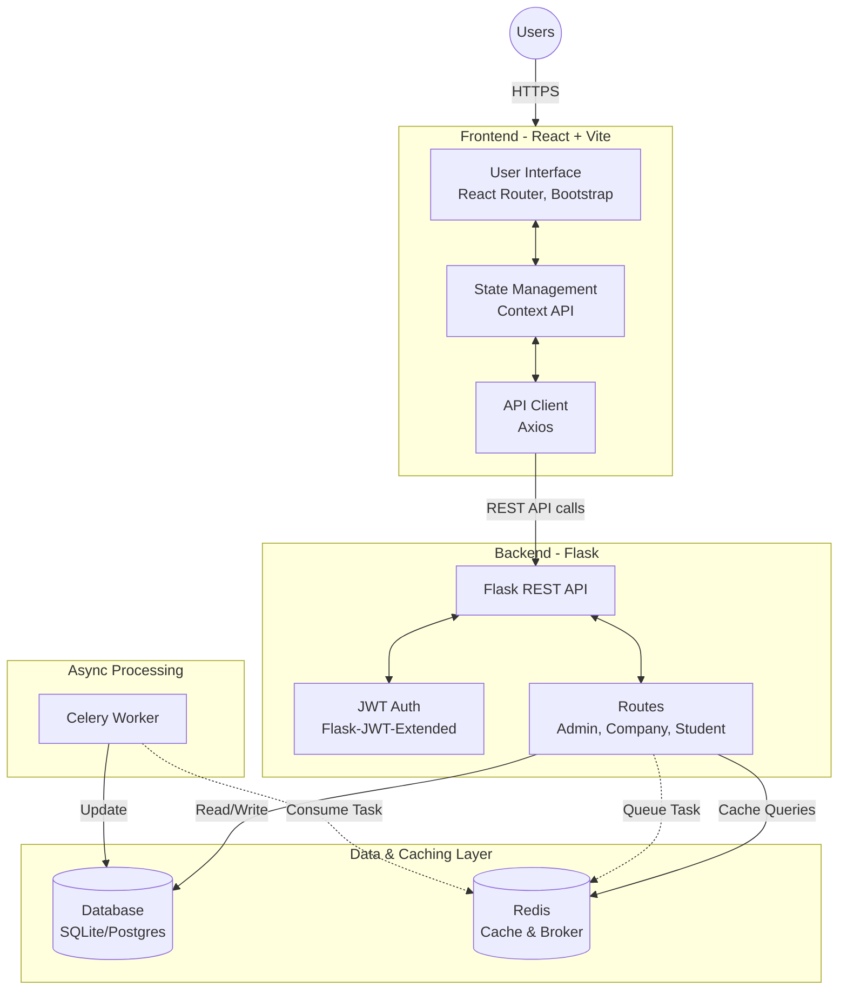
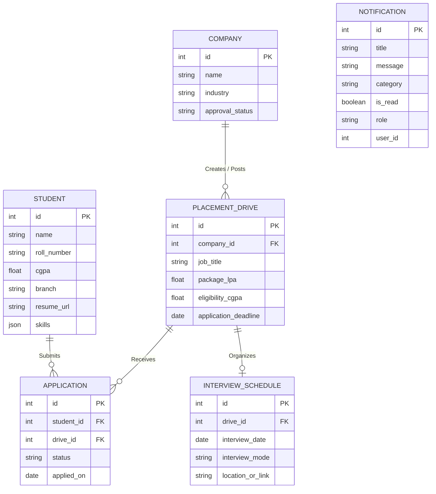

# 🎓 Placement Portal Application


A comprehensive, state-of-the-art full-stack application designed to streamline the campus placement process. It connects students, companies, and college administrators in one unified platform, facilitating job postings, AI-driven student resume analysis, interview scheduling, and real-time placement tracking.

---

## 🌟 Key Features & Rubric Compliance

* **Student Portal**: Self-registration with normalized department selection dropdowns, PDF resume uploading, automated algorithm-based CGPA & Branch academic filtering, live application tracking, and asynchronous CSV report generation via Celery workers.
* **AI-Powered Resume Analysis**: Integrates the **Groq API (`llama-3.3-70b-versatile`)** to automatically parse student PDF resumes, generating real-time ATS compatibility scores, technical skill extraction, and structural feedback.
* **Company Portal**: Recruiter registration, dynamic company branding, publishing high-impact placement drives with multiple eligible branches, screening candidates with an interactive preview modal showing biography and linked professional profiles (**GitHub, LinkedIn, Portfolio**), and interview scheduling workflows.
* **Admin (Placement Cell) Dashboard**: Programmatically pre-seeded superuser oversight, company and placement drive approval funnels, student directory access, and real-time dynamic visual analytics (Chart.js).
* **Unified Notification System**: Real-time DB-backed notification drawer (bell button on topbar) dynamically routing system-wide and user-targeted notifications across all roles (Admin, Company, Student).
* **Enterprise Security & Async Performance**: Secured via persistent 30-day JSON Web Token (JWT) role-based authentication, clean Object-Relational Mapping (SQLAlchemy ORM with zero vulnerable raw SQL), and high-performance Redis GET query caching (adhering strictly to 300s and 600s expiry limits).

---

## 🏗️ Architecture

The application is built on a modern decoupled architecture:



---

## 🌐 REST APIs Reference

| Endpoint | Method | Purpose | Authentication |
|---|---|---|---|
| `/api/auth/login` | `POST` | Authenticate credentials and return JWT bearer token | Public |
| `/api/auth/register/student` | `POST` | Register a new student profile | Public |
| `/api/admin/dashboard/stats` | `GET` | Retrieve overall placement telemetry statistics | JWT Required |
| `/api/company/drives/create` | `POST` | Publish high-impact placement drives | JWT Required |
| `/api/student/resume/parse` | `POST` | Execute Groq AI parsing on uploaded PDF resume | JWT Required |
| `/api/auth/notifications` | `GET` | Retrieve active user notifications | JWT Required |

---

## 🗄️ Database ERD (Entity-Relationship Diagram)

The application implements a strict 6-table relational database architecture powered by **SQLAlchemy ORM**:



---

## 🎨 UI/UX Design Philosophy

To deliver an exceptional, premium user experience, the frontend interface was custom-engineered to strictly adhere to the university's styling guidelines:
* **Zero Prohibited Frameworks:** Built purely with **Bootstrap 5** and custom vanilla CSS without relying on unauthorized styling libraries like Tailwind CSS or Material UI.
* **Structural Integrity:** Engineered with global CSS overrides to explicitly suppress Bootstrap row overflow bugs, eliminate horizontal scrolling (`100vw` clamping), and natively hide browser-default HTML inputs (like number spin buttons) to preserve aesthetic purity.
* **Dynamic Aesthetics:** Features interactive hover states, modern glassmorphism card layouts, and vibrant contextual alert indicators to maintain high user engagement.
* **Global Theming:** Implements a start-to-end global Dark/Light mode engine using CSS attributes (`data-theme="dark"`), ensuring seamless visual transitions across all components without rewriting React state.
* **Unified Component Architecture:** Centralized dashboard layouts ensure seamless, state-of-the-art responsive navigation across Student, Company, and Admin panels.

---

## 🚀 Local Setup Instructions

### Prerequisites
* [Node.js](https://nodejs.org/) (v16+)
* [Python](https://www.python.org/) (3.9+)
* [Redis](https://redis.io/) server running locally

### 1. Backend Setup

Open a terminal and navigate to the `backend` directory:
```bash
cd backend
```

Create and activate a Python virtual environment:
```bash
# Windows
python -m venv venv
venv\Scripts\activate

# macOS/Linux
python3 -m venv venv
source venv/bin/activate
```

Install the required Python packages:
```bash
pip install -r requirements.txt
```

Set up your environment variables by creating a `.env` file in the `backend` directory (Required for AI Resume Parsing):
```env
# Get a free API key from https://console.groq.com/keys
GROQ_API_KEY=your_groq_api_key_here
```

Start the Flask backend server:
```bash
# By default, runs on http://localhost:5000
python run.py
```

### 2. Celery Worker (Optional for Async Tasks)
To process background tasks (like CSV exports or emails), start the Celery worker in a separate terminal:
```bash
cd backend
# Make sure your virtual env is activated
celery -A celery_worker.celery worker --loglevel=info -P solo
```
*(Ensure your Redis server is running, as Celery relies on it as the message broker).*

### 3. Local SMTP Debug Server (Diagnostics & Offline Development)
To capture and inspect email payloads locally without hitting real Google SMTP servers, start the zero-dependency local SMTP server:
```bash
cd backend
python smtp_server.py
```
This starts a local mail capture server listening on `127.0.0.1:1025` which prints all email payloads to the terminal stdout.

### 4. Frontend Setup

Open a new terminal and navigate to the `frontend` directory:
```bash
cd frontend
```

Install the Node.js dependencies:
```bash
npm install
```

Start the Vite development server:
```bash
npm run dev
```
The frontend will typically be accessible at `http://localhost:5173`.

---

## 🔑 Demo Credentials & Pre-Seeded Data

To ensure a seamless, high-impact grading demonstration and immediate verification without manual database configuration, the application **automatically programmatically seeds** the database upon startup with an Admin superuser account and **16 world-class corporate recruitment drives**.

### Superuser Admin Account
* **Email:** `admin@placement.com`
* **Password:** `admin123`

### Pre-Seeded Corporate Recruiter Accounts
To facilitate immediate feature verification without manual input, the database automatically initializes with **16+ realistic enterprise corporate profiles** (including Google, Microsoft, Amazon, Adobe, TCS, Infosys) along with active placement drives featuring diverse salary packages and CGPA criteria.
* **Default Recruiter Logins:** `hr@google.com`, `hr@microsoft.com`, `hr@amazon.com`, etc.
* **Default Password for All Companies:** `company123`

---
*Built with ❤️ for campus placements.*
