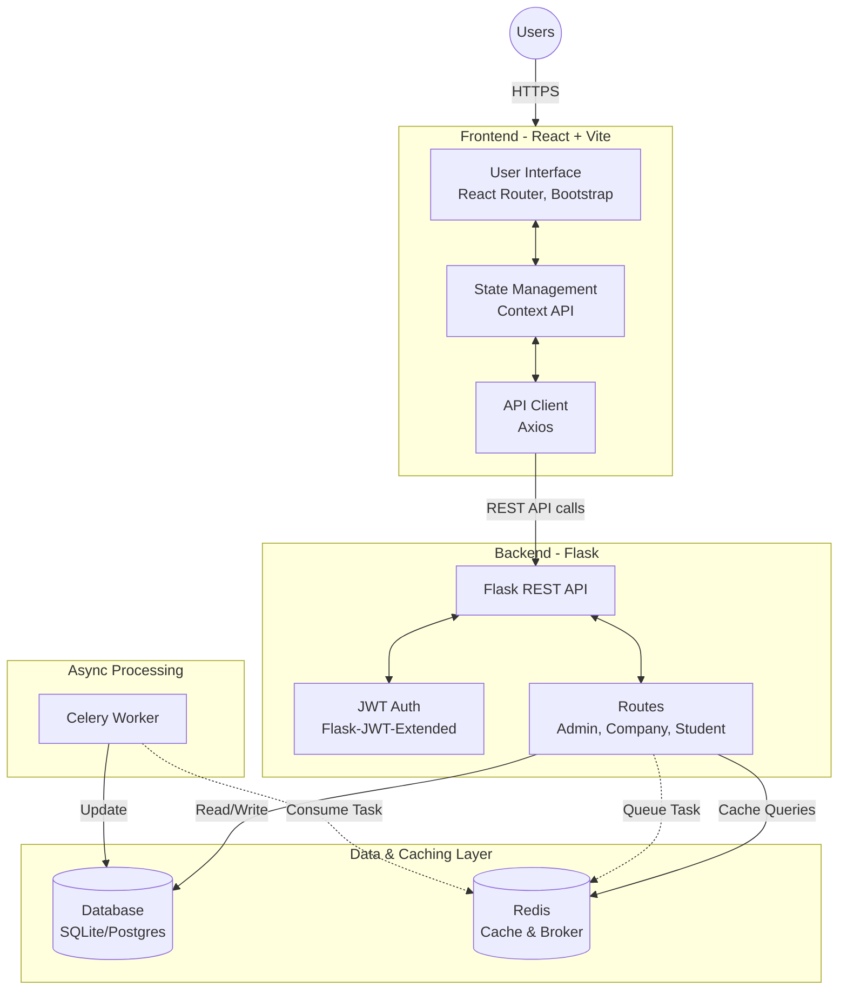

# Placement Portal Application

A comprehensive full-stack application designed to streamline the campus placement process. It connects students, companies, and college administrators in one unified platform, facilitating job postings, student applications, interview scheduling, and placement tracking.

## 🌟 Key Features

* **Student Portal**: Create professional profiles, upload resumes, browse active placement drives, and track application statuses.
* **Company Portal**: Register company profiles, post job/internship opportunities, review student applications, and schedule interviews.
* **Admin Dashboard**: Manage and approve company registrations, oversee all placement drives, and generate detailed placement analytics and reports.

## 🏗 Architecture

The application is built on a modern decoupled architecture:



## 🛠 Tech Stack

* **Frontend**: React 19, Vite, React Router DOM, Bootstrap 5, Chart.js, Axios
* **Backend**: Python, Flask, Flask-SQLAlchemy, Flask-JWT-Extended, Flask-Cors
* **Async Processing**: Celery, Redis (for background tasks & caching)
* **Database**: SQLite (local dev), PostgreSQL (production recommended)

## 🚀 Local Setup Instructions

### Prerequisites
* [Node.js](https://nodejs.org/) (v16+)
* [Python](https://www.python.org/) (3.9+)
* [Redis](https://redis.io/) server running locally

### 1. Backend Setup

Open a terminal and navigate to the `backend` directory:
```bash
cd backend
```

Create and activate a Python virtual environment:
```bash
# Windows
python -m venv venv
venv\Scripts\activate

# macOS/Linux
python3 -m venv venv
source venv/bin/activate
```

Install the required Python packages:
```bash
pip install -r requirements.txt
```

Start the Flask backend server:
```bash
# By default, runs on http://localhost:5000
python run.py
```

### 2. Celery Worker (Optional for Async Tasks)
To process background tasks (like CSV exports or emails), start the Celery worker in a separate terminal:
```bash
cd backend
# Make sure your virtual env is activated
celery -A app.celery_tasks worker --loglevel=info
```
*(Ensure your Redis server is running, as Celery relies on it as the message broker).*

### 3. Frontend Setup

Open a new terminal and navigate to the `frontend` directory:
```bash
cd frontend
```

Install the Node.js dependencies:
```bash
npm install
```

Start the Vite development server:
```bash
npm run dev
```
The frontend will typically be accessible at `http://localhost:5173`.

## ☁️ Deployment

This project is configured for seamless deployment on platforms like Vercel. 
- The `backend/vercel.json` and root `vercel.json` are provided to handle serverless function routing for the Flask API and SPA fallbacks for the React frontend.
- **Frontend Live URL:** [https://placement-portal-application-iota.vercel.app](https://placement-portal-application-iota.vercel.app)
- **Backend API URL:** [https://placement-portal-application-gnpb.vercel.app](https://placement-portal-application-gnpb.vercel.app)
