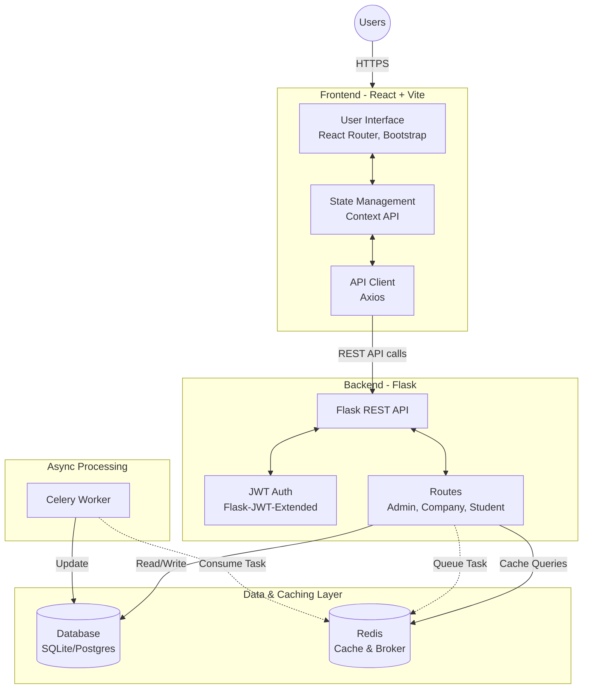
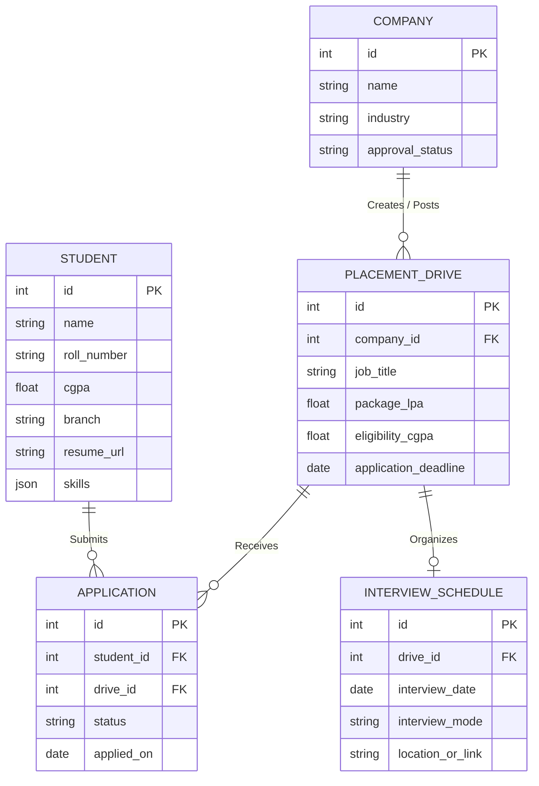

# Placement Portal Application

A comprehensive full-stack application designed to streamline the campus placement process. It connects students, companies, and college administrators in one unified platform, facilitating job postings, student applications, interview scheduling, and placement tracking.

## 🌟 Key Features

* **Student Portal**: Create professional profiles, upload resumes, browse active placement drives, and track application statuses.
* **Company Portal**: Register company profiles, post job/internship opportunities, review student applications, and schedule interviews.
* **Admin Dashboard**: Manage and approve company registrations, oversee all placement drives, and generate detailed placement analytics and reports.

## 🏗 Architecture

The application is built on a modern decoupled architecture:



## 🗄️ Database ERD (Entity-Relationship Diagram)

The application implements a strict 5-table relational database architecture powered by **SQLAlchemy ORM**:



## 🛠 Tech Stack

* **Frontend**: React 19, Vite, React Router DOM, Bootstrap 5, Chart.js, Axios
* **Backend**: Python, Flask, Flask-SQLAlchemy, Flask-JWT-Extended, Flask-Cors
* **Async Processing**: Celery, Redis (for background tasks & caching)
* **Database**: SQLite (local dev), PostgreSQL (production recommended)

## 🚀 Local Setup Instructions

### Prerequisites
* [Node.js](https://nodejs.org/) (v16+)
* [Python](https://www.python.org/) (3.9+)
* [Redis](https://redis.io/) server running locally

### 1. Backend Setup

Open a terminal and navigate to the `backend` directory:
```bash
cd backend
```

Create and activate a Python virtual environment:
```bash
# Windows
python -m venv venv
venv\Scripts\activate

# macOS/Linux
python3 -m venv venv
source venv/bin/activate
```

Install the required Python packages:
```bash
pip install -r requirements.txt
```

Start the Flask backend server:
```bash
# By default, runs on http://localhost:5000
python run.py
```

### 2. Celery Worker (Optional for Async Tasks)
To process background tasks (like CSV exports or emails), start the Celery worker in a separate terminal:
```bash
cd backend
# Make sure your virtual env is activated
celery -A app.celery_tasks worker --loglevel=info
```
*(Ensure your Redis server is running, as Celery relies on it as the message broker).*

### 3. Frontend Setup

Open a new terminal and navigate to the `frontend` directory:
```bash
cd frontend
```

Install the Node.js dependencies:
```bash
npm install
```

Start the Vite development server:
```bash
npm run dev
```
The frontend will typically be accessible at `http://localhost:5173`.

## 🔑 Demo Credentials & Pre-Seeded Data

To ensure a seamless, high-impact grading demonstration and immediate verification without manual database configuration, the application **automatically programmatically seeds** the database upon startup with an Admin superuser account and **16 world-class corporate recruitment drives**.

### Superuser Admin Account
* **Email:** `admin@placement.com`
* **Password:** `admin123`

### Pre-Seeded Corporate Recruiters (16 Companies)
All 16 seeded companies share a uniform test login password: `company123`.

| # | Company Name | Email Login | Job Title Offered | Package (LPA) | Min CGPA |
|---|---|---|---|---:|---:|
| 1 | **Google** | `hr@google.com` | Software Engineer (L3) | **45.0 LPA** | **8.0** |
| 2 | **Microsoft** | `hr@microsoft.com` | Cloud Solutions Developer | **42.0 LPA** | **7.5** |
| 3 | **Amazon** | `hr@amazon.com` | SDE-1 | **38.0 LPA** | **7.2** |
| 4 | **Adobe** | `hr@adobe.com` | Product Engineer | **32.0 LPA** | **7.8** |
| 5 | **Goldman Sachs** | `hr@gs.com` | Technology Analyst | **28.0 LPA** | **7.5** |
| 6 | **Qualcomm** | `hr@qualcomm.com` | Embedded Systems Engineer | **26.0 LPA** | **7.5** |
| 7 | **Oracle** | `hr@oracle.com` | Database Architect | **24.0 LPA** | **7.0** |
| 8 | **Cisco** | `hr@cisco.com` | Network Security Engineer | **22.0 LPA** | **7.0** |
| 9 | **IBM** | `hr@ibm.com` | AI & Quantum Associate | **18.0 LPA** | **6.8** |
| 10 | **Accenture** | `hr@accenture.com` | Technology Analyst | **12.0 LPA** | **6.5** |
| 11 | **Infosys** | `hr@infosys.com` | Specialist Programmer | **9.5 LPA** | **6.5** |
| 12 | **Tech Mahindra** | `hr@techmahindra.com` | Cybersecurity Specialist | **8.0 LPA** | **6.5** |
| 13 | **Capgemini** | `hr@capgemini.com` | Cloud Associate | **7.5 LPA** | **6.2** |
| 14 | **TCS** | `hr@tcs.com` | Digital Ninja Developer | **7.5 LPA** | **6.0** |
| 15 | **Cognizant** | `hr@cognizant.com` | Gen-C Next Engineer | **6.75 LPA** | **6.0** |
| 16 | **Wipro** | `hr@wipro.com` | Turbo Associate | **6.5 LPA** | **6.0** |

